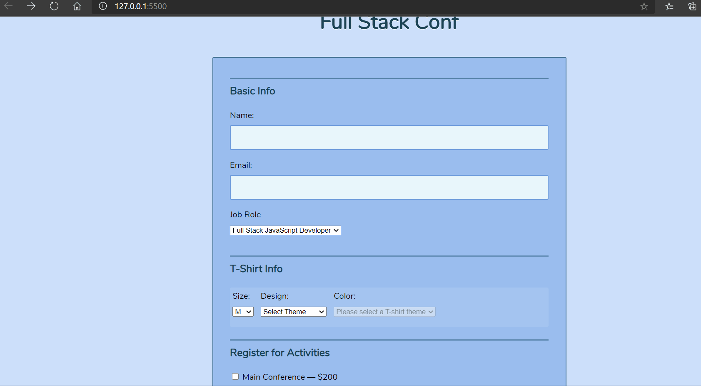

# **Interactive Form**

## Project Description:

This project basically showcases a form which validates all the input fields. There are some fields that are dynamically generated for eg: when user clicks job role as "other" or when user selects different themes for t-shirt design.
In the end when user clicks submit button the program checks for all the fields to make sure nothing is left empty.

## Gify:
Here is an example
